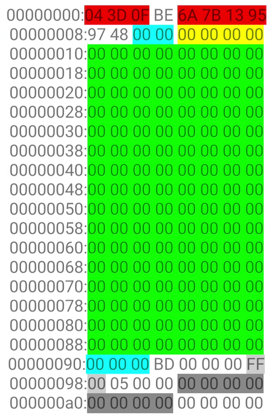
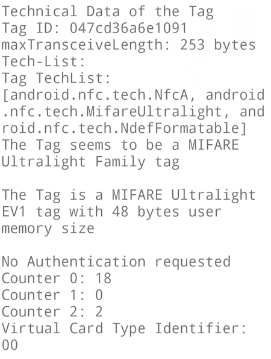
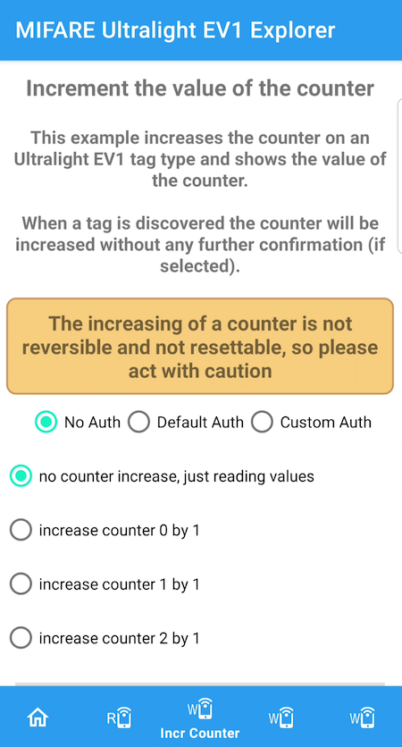
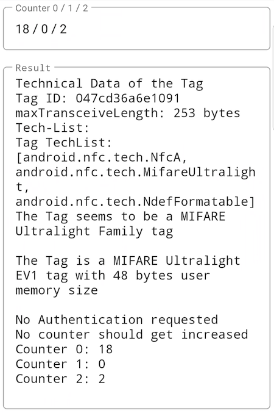
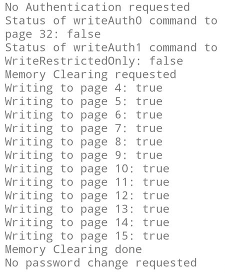

# MIFARE Ultralight EV1 Explorer

## Description

This app reads and writes data to NXP's MIFARE Ultralight EV1 tag. It is tested with a fabric new Ultralight EV1 type.

**Please do not use a MIFARE Ultralight or Ultralight C tag with this app** - these have a similar command set but are different 
in Authentication, page locking, counter and other details. Using these tags with the app may brick your tag.

The tutorial to this app is available on medium.com: https://medium.com/@androidcrypto/explore-a-mifare-ultralight-ev1-nfc-tag-android-java-a23d0b4b0ea5

## Data Sheet

The Mifare Ultralight EV1 datasheet is a good source for all questions regarding programming this tag:

MIFARE Ultralight EV1: Get the datasheet here MF0ULX1: https://www.nxp.com/docs/en/data-sheet/MF0ULX1.pdf

The datasheet is available in the docs folder of this repository, but it is always better to get one from the origin source.

## Usage

There are 5 icons in the "Bottom Navigation Bar":

1) Home: gives an overview about the app and shows the license terms of material used for the app.
2) Read: tries to read the complete content of the tag and display the data in a colored dump.
3) Write Counter: increases the 24-bit one way counter by "1".
4) Write Data: writes up to 16 characters to 4 subsequent pages of the user memory. Another option is to write a current timestamp to the tag.
5) Write Configuration: Select the page a memory protection is active. Selecting page 48 disables any memory protection. Select the mode of memory protection: write access only or read and write access. Select if you want to clear the user memory. The last option is to leave or change the current password (change to the Default or Custom key).

## Screenshots of the app:

### Home Fragment:


### Read Fragment







### Write Counter Fragment





### Write Data Fragment


### Write Configuration Fragment




## What is not possible with this app ?

I excluded any writing to the Lock Bytes and the One Time Programming (OTP) area. This is due to the fact that 
these bits and bytes are just settable, If a bit in this bytes is set it remains set - there is no reset, 
clearing or deleting of the data written to the tag.

## Material used for this app

**Icons**: https://www.freeiconspng.com/images/nfc-icon

Nfc Simple PNG Transparent Background: https://www.freeiconspng.com/img/20581

<a href="https://www.freeiconspng.com/img/20581">Nfc Png Simple</a>

**Sounds**: Sound files downloaded from Material Design Sounds: https://m2.material.io/design/sound/sound-resources.html 

## Technical details

Minimum SDK is 21 (Android 5)

### Authentication of a MIFARE Ultralight EV1:

The Ultralight EV1 tag uses a 4 bytes long password for authentication and a 2 bytes long PACK (Password Acknowledge). 

I'm using 2 predefined keys (password) and PACK in the app:

```plaintext
byte[] defaultPassword = hexStringToByteArray("FFFFFFFF");
byte[] defaultPack = hexStringToByteArray("0000");
byte[] customPassword = hexStringToByteArray("12345678");
byte[] customPack = hexStringToByteArray("9876");
```

### Counter on Mifare Ultralight-C:
```plaintext
8.7 Counter functionality
The MF0ULx1 features three independent 24-bit one-way counters. These counters are located in a separate 
part of the NVM which is not directly addressable using READ, FAST_READ, WRITE or COMPATIBILITY_WRITE 
commands. The actual value can be retrieved by using the READ_CNT command, the counters can be incremented
with the INCR_CNT command. The INCR_CNT command features anti-tearing support, thus no undefined values 
originating from interrupted programing cycles are possible. Either the value is unchanged or the correct, 
incremented value is correctly programmed into the counter. The occurrence of a tearing event can be checked 
using the CHECK_TEARING_EVENT command.

In the initial state, the counter values are set to 000000h.

The counters can be incremented by an arbitrary value. The incremented value is
valid immediately and does not require a RF reset or re-activation. Once counter value reaches FFFFFFh and an 
increment is performed via a valid INCR_CNT command, the MF0ULx1 replies a NAK. If the sum of the addressed 
counter value and the increment value in the INCR_CNT command is higher than FFFFFFh, the MF0ULx1 replies a 
NAK and does not update the respective counter.

An increment by zero (000000h) is always possible, but does not have any impact on the counter value.
```

## License

MIFARE Ultralight EV1 Explorer is available under the MIT license. See the LICENSE.md file for more info.
